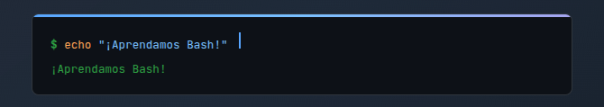

# Bash desde CERO

¡Bienvenido!  
Este repositorio contiene dicumentacion y comandos para aprender Bash desde cero.  
Ideal para principiantes y personas que quieren dominar el shell scripting en Linux.

## Contenidos

- Introducción a Bash
- Comandos básicos de Linux
- Estructuras de control (if, while, for)
- Funciones y variables
- Manipulación de archivos y texto
- Scripts útiles

## Instalación

No necesitas instalar nada extra si ya tienes Bash instalado en tu sistema.  
Para verificarlo, abre tu terminal.

  

